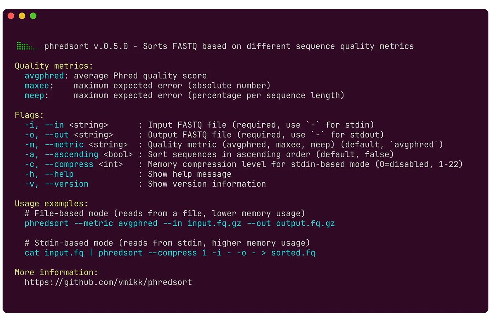

# phredsort

[](https://doi.org/10.5281/zenodo.14395125)
[](https://codecov.io/gh/vmikk/phredsort)

`phredsort` is a command-line tool for sorting sequences in FASTQ files by their quality scores.

## Usage

Basic usage:
```bash
# Read from `input.fastq.gz` and write to `output.fastq.gz`
phredsort -i input.fastq.gz -o output.fastq.gz

# Read from stdin and write to stdout
zcat input.fastq.gz | phredsort --in - --out - | less -S
```




### Sort sequences using pre-computed maxEE scores in headers
```bash
phredsort headersort -i input.fasta -o output.fasta --metric maxee
```

### Sort by avgphred scores with quality filtering
```bash
phredsort headersort -i input.fastq -o output.fastq --metric avgphred --minqual 20 --maxqual 40
```

### Sort in ascending order (lower quality first)
```bash
phredsort headersort -i input.fa -o output.fa --metric meep --ascending
```

Examples of supported header formats:
- Space-separated: ">seq1 maxee=2.5 size=100"
- Semicolon-separated: ">seq1;maxee=2.5;size=100"


## Installation

### Download compiled binary (for Linux)

```bash
wget https://github.com/vmikk/phredsort/releases/download/1.3.0/phredsort
chmod +x phredsort
./phredsort --help
```

### Build from source

```bash
git clone --depth 1 https://github.com/vmikk/phredsort
cd phredsort
go build -ldflags="-s -w" phredsort.go
./phredsort --help
```


## Quality metrics

`phredsort` supports several metrics (`--metric` parameter) to assess sequence quality:

#### 1. (Back-transformed) average Phred score (`avgphred`)
- Properly calculated mean quality score that accounts for the logarithmic nature of Phred scores
- Converts Phred scores to error probabilities, calculates their arithmetic mean, then converts back to Phred scale
- Formula: `-10 * log10(mean(10^(-Q/10)))`
- More accurate than simple arithmetic mean of Phred scores, which would overestimate quality

#### 2. Maximum expected error (`maxee`) (as per Edgar & Flyvbjerg, 2014)
- Sum of error probabilities for all bases in a sequence
- Formula: `sum(10^(-Q/10))`
- Higher values indicate lower quality
- Depends on sequence length (longer sequences tend to have higher MaxEE)

#### 3. Maximum expected error percentage (`meep`)
- MaxEE standardized by sequence length
- Represents expected number of errors per 100 bases
- Formula: `(MaxEE * 100) / sequence_length`
- Higher values indicate lower quality
- Allows fair comparison between sequences of different lengths

#### 4. Low quality base count (`lqcount`)
- Number of bases below specified quality threshold
- Useful for binned quality scores (e.g., data from Illumina NovaSeq platform)
- Counts bases with Phred score < threshold (default: 15)
- Higher values indicate lower quality

#### 5. Low quality base percentage (`lqpercent`)
- Percentage of bases below quality threshold
- Formula: `(lqcount * 100) / sequence_length`
- Higher values indicate lower quality
- Normalizes low-quality base count by sequence length


