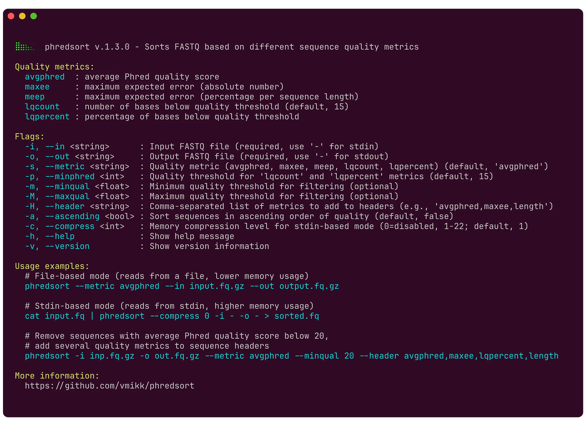

# phredsort

[](https://doi.org/10.5281/zenodo.14395125)
[](https://codecov.io/gh/vmikk/phredsort)

`phredsort` is a command-line tool for sorting sequences in a FASTQ file by their quality scores.

## Usage

Basic usage:
```bash
# Read from `input.fastq.gz` and write to `output.fastq.gz`
phredsort -i input.fastq.gz -o output.fastq.gz

# Read from stdin and write to stdout
zcat input.fastq.gz | phredsort --in - --out - | less -S
```




## Installation

### Download compiled binary (for Linux)

```bash
wget https://github.com/vmikk/phredsort/releases/download/1.3.0/phredsort
chmod +x phredsort
./phredsort --help
```


